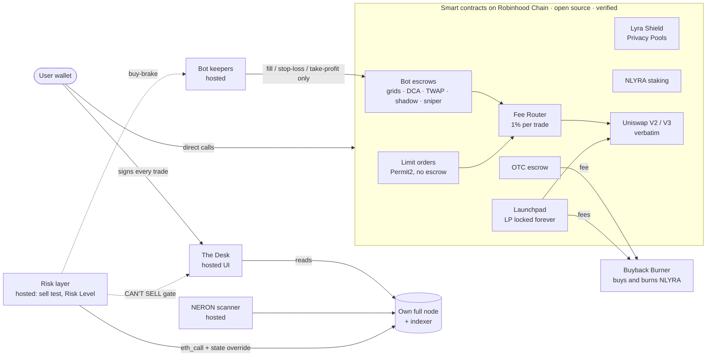

# NLYRA: the risk layer for Robinhood Chain

**Risk layer for Robinhood Chain: a live sell test and Risk Level for every token, a can't-sell gate in our Desk and non-custodial bots that stop buying traps. Own node, open contracts.**

-8B7CF6)


**42% of new tokens stop trading within 24 hours** (measured on our own node, 9,559 tokens, Aug 10 – Sep 22). On a chain like that, the most useful thing a trading platform can do is tell you, before you buy, whether you will be able to sell. That is what NLYRA is built around.

- **The risk layer** (hosted): a live **sell test** for every token, simulated against the real pool on our own node, and a **Risk Level** computed from launch facts. It blocks can't-sell buys on **The Desk**, blocks bot creation on can't-sell tokens, and brakes bots that would keep buying a trap. Anyone can query it at [`nlyra.xyz/api/risk`](https://nlyra.xyz/api/risk?token=0xb9d3824149ad8ac984153ceec91d5a2405d1fb95). See [Risk layer](#risk-layer-hosted-service-closed-source).
- **The Desk**, a trading terminal on Robinhood Chain (Arbitrum Orbit, chainId 4663) running on our own full node and indexer, with the **NERON** forensic scanner tagging every new token within seconds.
- **Non-custodial trading bots** (spot and infinity grids, DCA, TWAP, martingale, ladder, copy trading, launch sniper), an **OTC desk** for block trades, a **launchpad** that locks liquidity forever, a verbatim **Uniswap V2/V3 DEX**, **Lyra Shield** private transfers (Privacy Pools) and **NLYRA staking**. Every bot and escrow is a smart contract where only the user can withdraw. Keepers can execute a strategy but can never move funds anywhere else.

> The Desk, the risk layer, the NERON scanner and the bot keepers are operated by us as hosted services (closed source). Everything that holds user funds, the smart contracts, is open, tested and verified on Blockscout and/or Sourcify.

## Live

| | |
|---|---|
| Home | [nlyra.xyz](https://nlyra.xyz) |
| The Desk (trading terminal) | [nlyra.xyz/desk](https://nlyra.xyz/desk) |
| Real Yield Staking v2 (preview) | [nlyra.xyz/newstake](https://nlyra.xyz/newstake) |
| OTC Desk | [nlyra.xyz/otc](https://nlyra.xyz/otc) |
| Bots, from zero (wiki) | [nlyra.xyz/wiki/bots](https://nlyra.xyz/wiki/bots) |
| FAQ | [nlyra.xyz/faq](https://nlyra.xyz/faq) |
| Buildathon entry | [NERON & LYRA on HackQuest](https://www.hackquest.io/projects/NERON-and-LYRA-cTBn41) |

**Measured on 2026-09-28** from the public APIs, which need no account:
- The scanner has classified **106,347** tokens from **52,925** deployer wallets ([`/api/desk/stats`](https://nlyra.xyz/api/desk/stats)).
- **374.2M NLYRA** is staked in StakingRewards ([`/api/staking`](https://nlyra.xyz/api/staking)).
- **42** launches are listed on the launchpad ([`/api/launch/list`](https://nlyra.xyz/api/launch/list)).
- **874,480,802 NLYRA** is in circulation ([`/api/supply/circulating`](https://nlyra.xyz/api/supply/circulating)).

## Risk layer (hosted service, closed source)

What it does:

- **Sell test.** For every token we simulate a buy and a sell against the **live pool** with a single `eth_call` plus a state override, on our own node, at the current block. It runs on ETH/WETH and USDG pools and reports whether the token can be sold, the round trip, and the effective buy and sell tax. Nothing is sent on-chain.
- **CAN'T SELL gate.** When the sell test fails, The Desk refuses the buy and the bot form refuses to create a bot on that token.
- **Bot buy-brake.** While a bot runs, our hosted services keep re-checking the token, and the keeper stops placing the bot's **buys** if it turns into a trap. The brake never sells and never touches the escrow: the owner can still stop and withdraw at any time.
- **Risk Level v1.** A score from five facts about the token's launch. Out of sample, on the newest 1,912 tokens, it ranks tokens that stop trading within 24 hours with an **AUC of 0.801**, versus 0.708 for our scanner's previous score.
- **Public API**, no account needed: `https://nlyra.xyz/api/risk?token=0x…`

```bash
curl -s "https://nlyra.xyz/api/risk?token=0x2f853bfabc74db75c59c5ca76a6b2afa1ea0a5b8"
```

Real response from 2026-09-29 00:56 UTC, trimmed (a fresh token on a Uniswap V4 pool whose hook takes 99.5% of every sell):

```json
{
  "ok": true,
  "token": "0x2f853bfabc74db75c59c5ca76a6b2afa1ea0a5b8",
  "symbol": "ORDESK",
  "v": "risk-v1",
  "cantSell": true,
  "tier": "CantSell",
  "sell": {
    "tested": true,
    "canBuy": true,
    "canSell": false,
    "roundTripPct": 0.5,
    "buyTaxPct": 0,
    "sellTaxPct": 99.5,
    "notes": ["dynamic-fee pool: hook fee is counted inside sell tax", "round trip below 50%", "high tax", "sell gas above 2M"],
    "amount": "0.01",
    "unit": "ETH",
    "kind": "v4",
    "quote": "0x0bd7d308f8e1639fab988df18a8011f41eacad73"
  },
  "live": { "critical": true, "reasons": ["our sell test got back 0.5%"] },
  "updatedAt": "2026-09-29T00:56:49.342Z"
}
```

**What is and is not on-chain.** The gate and the brake are enforced **off-chain** by our hosted services (The Desk front end and API, and the bot keeper). The contracts guarantee **custody**, not risk: they do not know about the sell test, and a user who calls a contract directly is not gated. The Risk Level model's weights and rules are not published.

## USDG (Paxos Global Dollar)

USDG (`0x5fc5360D0400a0Fd4f2af552ADD042D716F1d168`) is a first-class quote asset across the platform:

| Where | How USDG is used | Contract |
|---|---|---|
| Spot Grid USDG | Grid funded in USDG, profit banked in USDG (v3 generation; the v4 compound grids are ETH-only) | [`0xdd13354cfE3E79a944d8F93476176F016f6311e4`](https://robinhoodchain.blockscout.com/address/0xdd13354cfE3E79a944d8F93476176F016f6311e4) |
| Infinity Grid USDG | Infinity grid quoted in USDG, with floor, take-profit and stop-loss (v3 generation) | [`0x551C66EF613c283FC439AE21DFa9C54c6f6b19a3`](https://robinhoodchain.blockscout.com/address/0x551C66EF613c283FC439AE21DFa9C54c6f6b19a3) |
| Fee Router v2 | `isQuoteToken(USDG) == true`: USDG is a quote token for routing and fees | [`0x9d1eA9Abbb99D813b7acA7666285CDed7f833565`](https://robinhoodchain.blockscout.com/address/0x9d1eA9Abbb99D813b7acA7666285CDed7f833565) |
| Limit Orders v2 | The generic V2/V3 path accepts any ERC20, USDG included | [`0xAd100f712FA482938adCe1dc08B3B30C8834cBBb`](https://robinhoodchain.blockscout.com/address/0xAd100f712FA482938adCe1dc08B3B30C8834cBBb) |
| OTC Desk | USDG as a payment currency for block trades | [`0x9656513aC910a9839B51dB7c92a6914ABB4F52e8`](https://robinhoodchain.blockscout.com/address/0x9656513aC910a9839B51dB7c92a6914ABB4F52e8) |
| SendTo v2 | Buy paying with USDG and deliver the output to another wallet | [`0x0eF655f16345afb66b42d4e65B71a16052d1Ddc0`](https://robinhoodchain.blockscout.com/address/0x0eF655f16345afb66b42d4e65B71a16052d1Ddc0) |
| Launch Factory v4 | Tokens can launch paired with USDG | [`0x4e4AD39E1A38104F8f74C3aF8d3F8c8E27f8836f`](https://robinhoodchain.blockscout.com/address/0x4e4AD39E1A38104F8f74C3aF8d3F8c8E27f8836f) |
| Bounty Escrow | Community bounties escrowed in USDG | [`0xf01a4bD90aeF8dD75FCb1EA6a3865Ac4b72DFF2c`](https://robinhoodchain.blockscout.com/address/0xf01a4bD90aeF8dD75FCb1EA6a3865Ac4b72DFF2c) |
| Real Yield Staking v2 | `ALL_USDG` claim mode: rewards paid in USDG through the WETH/USDG 0.01% pool | [`staking-v2/`](staking-v2/) (**live, closed beta**) |
| Risk layer | The sell test also runs on USDG pools | hosted service |

## Built during the Buildathon (Sep 13 – Oct 4)

| Date (UTC) | What | Deploy tx / evidence |
|---|---|---|
| Sep 13, 04:39 | **Shadow** copy trading `0xE26dd0A0…B3D2` | [`0xc57ee3e1…b890a`](https://robinhoodchain.blockscout.com/tx/0xc57ee3e1e131ee01c6c6c1c1d85e14b29c4a0c3fca65ed6614888e0f1efb890a) |
| Sep 19, 12:06 | **OTC Desk** `0x9656513a…52e8` | [`0x4300673b…2e5ce`](https://robinhoodchain.blockscout.com/tx/0x4300673b9443966ce8025304d9f34403e403b0643173f4237ab8c6a328d2e5ce) |
| Sep 20, 12:24 | **Sniper v2** `0x6B30B094…C84c` (after the security review of v1) | [`0xfd533496…76f44`](https://robinhoodchain.blockscout.com/tx/0xfd5334968ce9dfb0ce965e56cbba619cbb253e20e1e3aaa398e1ca6838776f44) |
| Sep 20, 15:38 | **SendTo v2** `0x0eF655f1…Ddc0` | [`0x14160bd0…7ec59`](https://robinhoodchain.blockscout.com/tx/0x14160bd00fe53c5cfd9e0486f3b00888c0665c1b2c2844eb5c93340b8d07ec59) |
| Sep 26 – 27 | **Risk layer**: sell test, CAN'T SELL gate, bot buy-brake, Risk Level v1, `/api/risk` | hosted service ([example](#risk-layer-hosted-service-closed-source)) |
| Sep 27 – 28 | **Real Yield Staking v2**: contracts, 211 fork tests, two internal audit rounds | [`staking-v2/`](staking-v2/) (deployed Sep 29, closed beta) |
| Sep 28 | Staking v2 **position transfers** and the **Position Market** | [`staking-v2/src/PositionMarket.sol`](staking-v2/src/PositionMarket.sol), [`staking-v2/test/r3/`](staking-v2/test/r3/) |

Spot Grid v4 (Sep 11, [`0x021aee16…3308d`](https://robinhoodchain.blockscout.com/tx/0x021aee16b556303b2cb17cca57ec1cd8afff94399511f1e9ec5220f54c73308d)) and Infinity Grid v4 (Sep 12, [`0xaa42408c…4c9cb`](https://robinhoodchain.blockscout.com/tx/0xaa42408ccf12911d8487d081638241c7de613d8e50a324790d604e311534c9cb)) predate the Buildathon window.

## Architecture



- **Custody never leaves the chain.** A bot is a position inside the user's own escrow record, and only its owner can call `stop` / `withdraw`. The keeper key can trigger only the execution paths the bot already authorised.
- **Nothing is upgradeable** except the Shield Entrypoint proxy, which uses the Privacy Pools design. Pausing blocks new entries, never a withdrawal.
- The full list of admin powers, contract by contract, is public at [nlyra.xyz/docs#admin-powers](https://nlyra.xyz/docs#admin-powers).

## Repository map

| Folder | What it is | Status |
|---|---|---|
| [`CONTRACTS.md`](CONTRACTS.md) | **Every deployed contract:** address, purpose, whether it holds user funds, source, Blockscout link, status | — |
| [`deployed/`](deployed/) | The exact verified source of every deployed address, with compiler settings and ABI | — |
| [`bots/`](bots/) | Bot contracts (Spot Grid v4, Infinity Grid v4, Shadow, Sniper, SendTo, Fee Router, Registry), mainnet-fork tests, reproducible verification | Live |
| [`otc/`](otc/) | OTC Desk: peer-to-peer block trades in a non-custodial escrow, with fork tests, scripts and the web page | Live |
| [`launchpad/`](launchpad/) | Architect Launch: tokens born with a pool, LP locked forever, buyback-and-burn treasury | Live |
| [`dex/`](dex/) | Uniswap V2 and V3 deployed verbatim, plus the single-file swap/liquidity frontend | Live |
| [`shield/`](shield/) | Lyra Shield: private NLYRA transfers on 0xbow Privacy Pools (zk proofs built in the browser) | Live |
| [`staking-v2/`](staking-v2/) | Real Yield Staking v2 (Foundry): 50% of NLYRA creator fees streamed to stakers. 211 mainnet-fork tests, two internal audit reports. Deployed at `0x5CB0Cb16cA019bcff4E494b32575848E4CdB5aF8` | **Live (closed beta)** |
| [`newstake/`](newstake/) | The staking v2 page ([nlyra.xyz/newstake](https://nlyra.xyz/newstake)) | Preview |
| [`desk/`](desk/) | What The Desk is and which contracts it uses (the service itself is closed source) | Live |
| [`wiki/`](wiki/) | "Bots, from zero", an illustrated guide ([nlyra.xyz/wiki/bots](https://nlyra.xyz/wiki/bots)) | Live |
| [`site/`](site/) | Snapshot of the public FAQ | Live |
| [`deployments/`](deployments/) | Machine-readable address book used by the tests and scripts | — |
| [`CONTINUITY.md`](CONTINUITY.md) | Continuity manual for Lyra Shield: which contracts run forever by themselves and how anyone can take over the Shield's off-chain roles (association-set publisher, relayer, frontend) | — |

## Security

- **Non-custodial by construction.** Escrowed funds can only go back to the owner, or to the counterparty in the same transaction on OTC fills. No owner function reaches user balances. `rescue` paths are capped at the surplus above escrow.
- **Verified sources.** Every contract that holds or moves user funds is verified on Blockscout, Sourcify or both. [`deployed/`](deployed/) holds the verified source for each address, so a reviewer can diff it against the working copies in this repo.
- **Tests on a mainnet fork.** The bot, SendTo, Sniper and OTC suites run against an anvil fork of Robinhood Chain, using the real fee router and real pools (126 checks for the Sniper, 17 for SendTo). Staking v2 has **211 Foundry tests** on a pinned fork, including stateful invariants and a differential model.
- **Internal audits.** Staking v2 went through two internal review rounds before any deployment; the findings and fixes are in [`AUDIT.md`](staking-v2/AUDIT.md), [`AUDIT-2.md`](staking-v2/AUDIT-2.md) and [`CHANGES.md`](staking-v2/CHANGES.md). The Sniper was redeployed as v2 after a security review, and v1 was paused before it ever held a bot.
- **Known trust assumptions, stated plainly.** Contract ownership sits on single keys, not a multisig. The keeper is a hosted service, so if it stops, bots stop trading, but every withdrawal still works directly on-chain.
- **Closed-source services.** The Desk, the risk layer, the NERON scanner and the bot keepers are hosted services and are not in this repository. None of them can move user funds. The CAN'T SELL gate and the bot buy-brake are enforced by these services, off-chain.

## Build and test

**Staking v2 (Foundry):**

```bash
cd staking-v2
FOUNDRY_PROFILE=dev forge build            # fast build without viaIR
RH_RPC=https://rpc.mainnet.chain.robinhood.com FORK_BLOCK=$(cast block-number --rpc-url $RH_RPC) FOUNDRY_PROFILE=dev forge test
forge test                                 # default profile (viaIR), the one used for final numbers
```

The fork tests read the RPC from `RH_RPC` (`robin = "${RH_RPC}"` in `foundry.toml`) and the block from `FORK_BLOCK`. Without `FORK_BLOCK` they fork the pinned block 74,478,703, which requires an **archive** RPC; the public RPC only serves recent state, hence `FORK_BLOCK=$(cast block-number …)`. `lib/` (forge-std and OpenZeppelin) is vendored, so no `forge install` is needed. Run one forge process at a time.

**Bots and OTC (Node + anvil fork):** the compile scripts, contracts and tests were run from one flat working directory, so put them side by side first. From `bots/`:

```bash
mkdir run && cp contracts/ArchitectSpotGridV4.sol contracts/ArchitectBotBase.sol scripts/compile-v4.js test/forktest-v4.js run/
cd run && npm i ethers solc@0.8.24
node compile-v4.js                               # writes artifacts/ArchitectSpotGridV4.{abi.json,bin}
anvil --fork-url https://rpc.mainnet.chain.robinhood.com --port 8901 --chain-id 4663 &
DESK_ADDRESSES=../../deployments/desk-addresses.json node forktest-v4.js
```

Each suite names its anvil port at the top (8901-8906); the same recipe works for the other suites with their contract and compile script ([`bots/README.md`](bots/README.md#running-a-fork-test), [`otc/README.md`](otc/README.md#running-the-fork-test)). Addresses are read from [`deployments/desk-addresses.json`](deployments/desk-addresses.json) (override with `DESK_ADDRESSES`). Deploy scripts read the RPC from `RH_RPC` (default: the public RPC) and the deployer key from the environment, never from the repo.

**Reproducing a verification:** each `bots/artifacts/<Contract>/<Contract>.input.json` and `otc/artifacts/ArchitectOTC.input.json` is the exact standard-JSON input behind the deployed bytecode; submit it to Sourcify, or to Blockscout as "Solidity (Standard JSON input)". Every `deployed/*/compiler.json` records the compiler and settings Blockscout matched.

## Quick facts

- **$NLYRA token:** `0xb9d3824149ad8ac984153ceec91d5a2405d1fb95`
- **RPC:** `https://rpc.mainnet.chain.robinhood.com` (chainId 4663)
- **Explorer:** [robinhoodchain.blockscout.com](https://robinhoodchain.blockscout.com)

## License

Our contracts, scripts and frontends are released under the [MIT License](LICENSE); every NLYRA contract carries `SPDX-License-Identifier: MIT`. Third-party code (Uniswap V2/V3, 0xbow Privacy Pools, poseidon-solidity, OpenZeppelin, forge-std, the Synthetix-style StakingRewards) keeps its original license: see [`THIRD_PARTY_NOTICES.md`](THIRD_PARTY_NOTICES.md).
